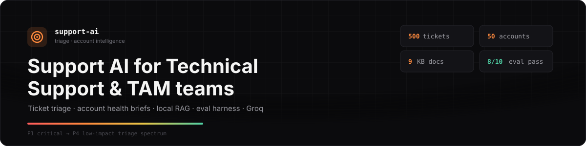
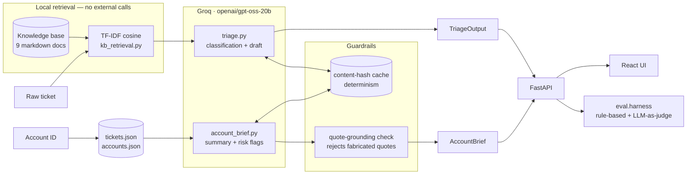

<p align="center">
  
</p>

<p align="center">
  
  
  
  
  
  
</p>

<p align="center">
  <b>US Delivery Internship — Technical Task Round</b><br/>
  Ticket triage, TAM account briefs, an eval harness, and a design note — built and verified end-to-end against the provided mock dataset.
</p>

<p align="center">
  <a href="#quick-start">Quick start</a> ·
  <a href="#what-this-is">What this is</a> ·
  <a href="#how-it-works">How it works</a> ·
  <a href="#eval-results">Eval results</a> ·
  <a href="#design-note-task-4">Design note</a> ·
  <a href="#worth-knowing-before-you-dig-in">Gotchas found in the data</a> ·
  <a href="#bonus-scorecard">Bonus</a>
</p>

---

## What this is

Two LLM-backed tools an internal support/TAM team would actually use, plus the
harness and eval report that let you trust them:

| | |
|---|---|
| 🎯 **Ticket triage** | Raw ticket in → product area, issue category, urgency (P1–P4) with reasoning, a matched knowledge-base doc, a responder team, and a ready-to-send draft response. Callable as a Python function *or* `POST /triage`. |
| 📋 **Account health brief** | Account ID in → an executive summary, churn/escalation risks (each backed by a **verbatim, code-checked quote** — not a paraphrase), and talking points for the TAM's next call. Deterministic on repeat runs. |
| ✅ **Eval harness** | 10 real test cases (5+ per task, ≥1 adversarial each), rule-based + LLM-as-judge scoring, a `pass/fail` + `0–1 quality score` per case, committed as `eval_report.md`/`.json` from an actual run — not a mock. |
| 📝 **Design note** | Failure modes, latency/quality trade-offs, data-sensitivity handling, and a scaling analysis — [jump to it](#design-note-task-4). |

Everything below the fold is real: every number in this README came from
actually running the code against the mock dataset, not from the spec.

## Quick start

```bash
git clone <this-repo> && cd zycus
pip install -r requirements.txt
cp .env.example .env              # add your GROQ_API_KEY — free at console.groq.com/keys

python run_demo.py                # Task 1 + Task 2, one sample run each
python -m eval.harness            # Task 3 — writes eval_report.json / eval_report.md
```

**REST API + React UI** (the bonus thin client):

```bash
uvicorn app.api:app --port 8000                        # terminal 1 — backend
cd ui/frontend && npm install && npm run dev            # terminal 2 — http://localhost:5173
```

<details>
<summary><b>REST API reference</b></summary>

| Method | Path | Body / Params | Returns |
|---|---|---|---|
| `POST` | `/triage` | `{"subject": "...", "body": "...", "product"?, "plan_tier"?}` | `TriageOutput` |
| `GET` | `/accounts/{account_id}/brief` | `?window_days=90` | `AccountBrief` |
| `GET` | `/accounts` | — | `[{account_id, company}, ...]` |
| `GET` | `/stats` | — | `{tickets, accounts, kb_docs}` |

</details>

## How it works



```
app/
├── config.py           env / model config
├── schemas.py           Pydantic I/O contracts for both tasks
├── data_loader.py       tickets.json / accounts.json + account↔ticket join
├── kb_retrieval.py      local TF-IDF retrieval over the knowledge base
├── llm.py               Groq call wrapper — determinism cache, retry-with-backoff
├── triage.py             Task 1 orchestration
├── account_brief.py      Task 2 orchestration + quote-grounding validator
├── prompts/              versioned prompts (VERSION + changelog per file)
└── api.py                FastAPI endpoints
eval/
├── cases_triage.json / cases_account_brief.json    5+ cases each, incl. adversarial
├── harness.py             rule-based + LLM-as-judge scoring → eval_report.*
└── judge.py               LLM-as-judge prompts
ui/frontend/               bonus UI — React 19 + Vite + Tailwind v4
```

## Worth knowing before you dig in

Two real characteristics of the mock dataset that would silently break a naive
implementation — found by actually inspecting the data, not by reading the spec:

> **Only 4 of the 500 tickets link to a real account.** `ACC-1785`, `ACC-3336`,
> `ACC-5748`, `ACC-7397` — the other 496 tickets reference account IDs outside
> the 50-account set entirely. So **46 of 50 accounts have zero linked tickets**
> in any window. The schema doc warns to "handle missing lookups gracefully" —
> at this scale, sparse data is the *majority* case, not an edge case, so the
> account brief says so plainly instead of inventing findings.

> **All ticket timestamps sit in Feb–May 2026.** "Last 90 days" is anchored to
> the dataset's own latest ticket (`data_loader.dataset_as_of`), not wall-clock
> `now()` — otherwise every account would show zero tickets regardless of the
> linkage issue above.

## Eval results

Real run, committed as [`eval_report.md`](eval_report.md) / [`eval_report.json`](eval_report.json):

<p align="left">
  
  
  
</p>

<details>
<summary><b>The 2 non-passes, explained</b> — left failing rather than loosened to force 10/10</summary>

- **`triage_04_integration_request`** — I expected P3/P4 for a bulk-import
  feature request; the model returned P2 with the defensible reasoning that
  the manual workaround has "major impact on workflow efficiency." The judge
  scored it 0.85/pass. This is my acceptance criteria being arguably too
  strict, not a misclassification.
- **`account_04_adversarial_no_recent_tickets`** — this account has 0 tickets
  in the 90-day *detail* window, but its account record has `open_tickets: 11`.
  My rule check looked for hedging language like "sparse data"; instead the
  model correctly used the account-level field and wrote "11 open tickets, all
  older than 90 days" — a better answer than my check anticipated. Judge
  scored it 0.9/pass. This is the eval harness's rule check being too rigid,
  not the pipeline being wrong.

</details>

<details>
<summary><b>Determinism: what actually happened</b> — the interesting bug of this project</summary>

Task 2 requires deterministic output for the same input. The first pass relied
on `temperature=0` + a fixed `seed`, which Groq documents as **best-effort** —
and running the same account brief 3× confirmed it is *not* exact for
`openai/gpt-oss-20b`: same underlying facts every time, different wording each
time. Since the brief explicitly permits "post-process to ensure this,"
`call_json()` now caches responses on a hash of
`(model, temperature, seed, system_prompt, user_prompt)` in
`.cache/llm_cache.json` — same input always returns the same cached output,
which is the guarantee that actually matters to a TAM re-running a brief
before a call. A genuinely-changed ticket history for the same account still
triggers a fresh call (the hash includes the rendered prompt), so this doesn't
mask real data changes — it only removes wording jitter on identical inputs.

</details>

## Design note (Task 4)

<details open>
<summary><b>Failure modes</b> — top 3, how they're detected and mitigated</summary>

1. **Hallucinated grounding.** An LLM asked to quote a ticket verbatim will
   sometimes paraphrase and present it as a quote — silently breaking the
   "every risk flag needs a real quote" requirement. *Mitigation:*
   `account_brief.py` does a code-side substring check (`_is_grounded`)
   against the actual ticket/escalation-note text and drops any quote that
   doesn't literally appear. In production I'd alert on a high drop-rate as a
   signal the prompt is drifting.
2. **Silent misclassification on adversarial input.** A vague ticket ("it
   broke, please fix") still needs *some* output. *Mitigation:* the
   adversarial eval case checks that `confidence` drops appropriately rather
   than the model confidently guessing P1. In production I'd route
   low-confidence triage to a human queue instead of auto-assigning.
3. **Schema drift from the model.** Groq JSON mode is reliable but not
   guaranteed — a malformed field currently raises inside Pydantic validation.
   *Mitigation:* this fails loudly rather than silently returning bad data,
   the right default for an internal tool — but I'd add one retry-with-error-
   feedback before failing in production.

</details>

<details>
<summary><b>Latency vs. quality</b></summary>

Groq specifically because tier-1 triage is a volume, low-latency workload — a
large model at high latency doesn't help an agent who needs a first-response
draft in under a second. The concrete trade-off: KB retrieval uses local
TF-IDF rather than a hosted embedding API + vector DB. Lower retrieval quality
on paraphrased queries (no semantic matching), but instant, free, and — since
the corpus is 9 docs — the recall loss is negligible. If latency were the hard
constraint beyond this, I'd move to a smaller/distilled model for the
classification fields and reserve a larger model only for draft-response
generation, since classification is the path an agent is blocked on.

</details>

<details>
<summary><b>Data sensitivity</b></summary>

Ticket bodies and account notes are exactly the kind of text that can carry
customer PII. Two design choices: (1) KB retrieval never leaves the machine —
local TF-IDF, not an embeddings API call, so ticket/account text isn't sent to
a second external vendor beyond the LLM provider. (2) Everything sent to Groq
is scoped to what's necessary for the task — no cross-account data is ever in
a single prompt. In production I'd add a PII-redaction pass (regex + NER)
before the prompt is built, and treat Groq's data-retention terms as a hard
requirement, not an assumption.

</details>

<details>
<summary><b>Scaling</b> — what breaks first at 10× ticket volume</summary>

First: the KB retrieval index (`kb_retrieval.load_chunks()` + TF-IDF fit) is
cached in-process but re-fit per process start — fine at this scale, wrong
pattern if the KB itself grows large; I'd persist a precomputed index to disk.
Second: the Groq API becomes the bottleneck via rate limits, not compute — I'd
add request batching/queuing and a cache keyed on ticket-content-hash, since
duplicate/near-duplicate tickets (a mass outage) are common at volume and
shouldn't re-trigger identical LLM calls. Third: the FastAPI process is
single-worker in the dev command above — production needs multiple uvicorn
workers behind a load balancer, orthogonal to anything task-specific here.

</details>

## Bonus scorecard

| Item | Status |
|---|---|
| Thin UI demo (+5) | ✅ Built as **React 19 + Vite + Tailwind v4** instead of the suggested Streamlit/Gradio — same brief ("a non-technical TAM could actually use it"), chosen for a more production-realistic frontend/backend split. See [`ui/frontend`](ui/frontend). |
| Prompt versioning (+2) | ✅ Each prompt lives in `app/prompts/<task>_v<n>.py` with a `VERSION` constant and a changelog docstring — a prompt change is a new version, not a silent edit. |
| CI eval gate (+2) | ✅ [`.github/workflows/eval.yml`](.github/workflows/eval.yml) runs `python -m eval.harness` on every push, using a `GROQ_API_KEY` repo secret. |
| Streaming (+3) | ❌ Not claimed. Prototyped, then deliberately removed — it split classification and draft-generation into two calls for a UX benefit that didn't justify the added complexity once the React UI made a single response feel instant anyway. |

## Notes on the API key

`.env` is git-ignored; [`.env.example`](.env.example) shows the required
variable names with placeholder values only. No key is committed anywhere in
this repo.

---

<p align="center">
  <sub>Built for the Zycus US Delivery Internship — Technical Task Round. See <a href="LOOM_SCRIPT.md">LOOM_SCRIPT.md</a> for the walkthrough outline.</sub>
</p>
